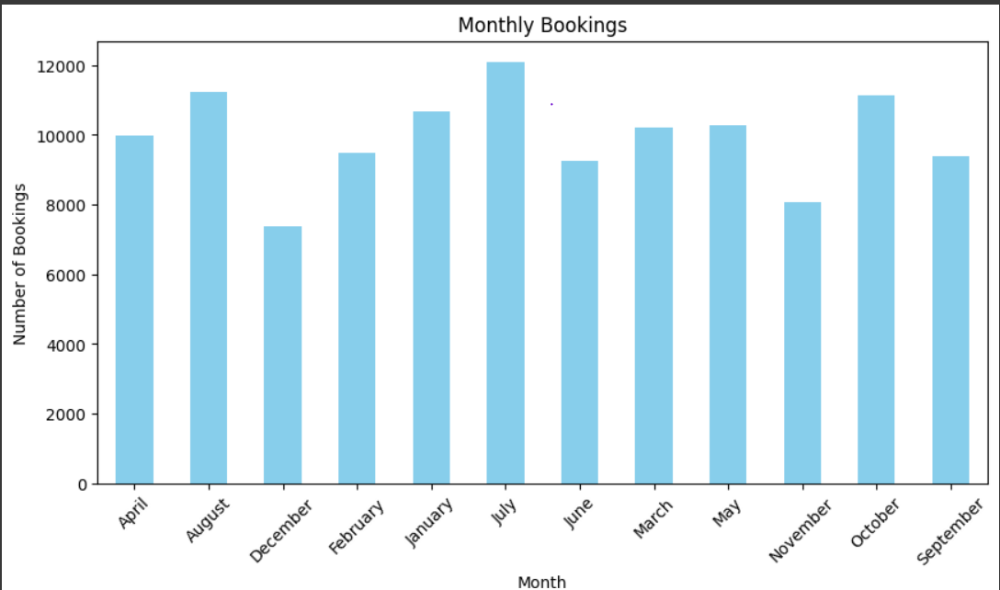
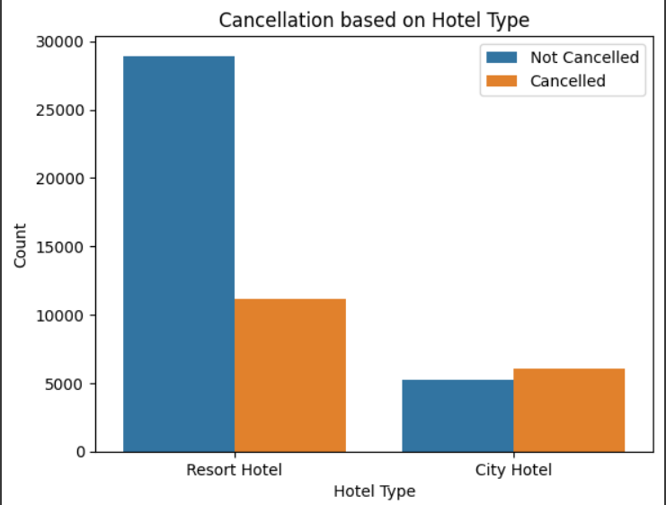
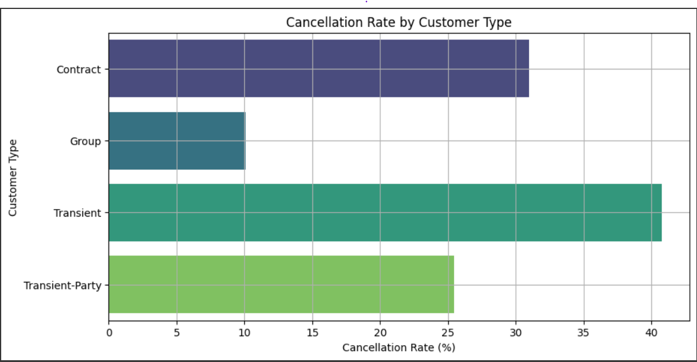

# Hotel Booking Analysis (EDA) 🏨🕵️‍♀️

## Introduction
The hospitality industry faces dynamic challenges, including fluctuating booking trends, high cancellation rates, and evolving customer preferences. This project explores the **Hotel Booking dataset** to analyze these trends, uncover customer behaviors, and identify factors influencing cancellations. The insights derived can aid hotels in optimizing their operations, improving customer satisfaction, and reducing cancellations.

## Objectives
- ✅ Perform data cleaning and preprocessing to handle missing and inconsistent data.
- ✅ Analyze booking trends across time, geography, and customer types.
- ✅ Investigate key factors contributing to cancellations and identify high-risk groups.
- ✅ Visualize the findings to make insights more interpretable.

## Tools Used🔧
- **Python Libraries**: `pandas`, `numpy`, `seaborn`, `matplotlib`, `plotly`
- **Environment**: Google Colab for interactive analysis and visualizations.

## Data Overview
- **Dataset**: [Hotel Booking Data](https://www.kaggle.com/jessemostipak/hotel-booking-demand)

## Insights
✅ **Booking Patterns**:
   - **Portugal** is the top country for bookings, highlighting its significance for targeted marketing strategies.
   - **City Hotels** are preferred over Resort Hotels, especially during non-holiday seasons.
   - Peak booking season is **July**, likely driven by summer vacations.

❌ **Cancellation Dynamics**:
   - **City Hotels** have a significantly higher cancellation rate, suggesting the need for retention strategies like flexible cancellation policies or targeted offers.
   - **Transient customers** exhibit higher cancellation rates, emphasizing the importance of understanding their booking behavior.

🛏️ **Customer Behavior**:
   - **Families with children** tend to book Resort Hotels more often, showcasing a preference for family-friendly amenities.
   - Cancellation rates are higher for transient customers, indicating last-minute plan changes.

## Visualizations
1. **Correlation Heatmap**: Shows relationships between numerical variables.  
   

2. **Monthly Booking Trends**: Highlights seasonality and high-demand periods.  
   

3. **Cancellation by Hotel Type**: Compares cancellation rates for City and Resort Hotels.  
   

4. **Cancellation by Customer Type**: Explores cancellation trends for different customer categories.  
   

## Next Steps 🚀
- **Predictive Modeling**: Build machine learning models to forecast cancellations and booking trends.
- **Hypothesis Testing**: Validate insights, such as the impact of deposit types on cancellations.
- **Customer Segmentation**: Use clustering techniques to identify distinct customer groups and their preferences.

## Acknowledgments
- Dataset provided by [Kaggle](https://www.kaggle.com).
- Inspired by the data science and hospitality community for actionable analytics.
