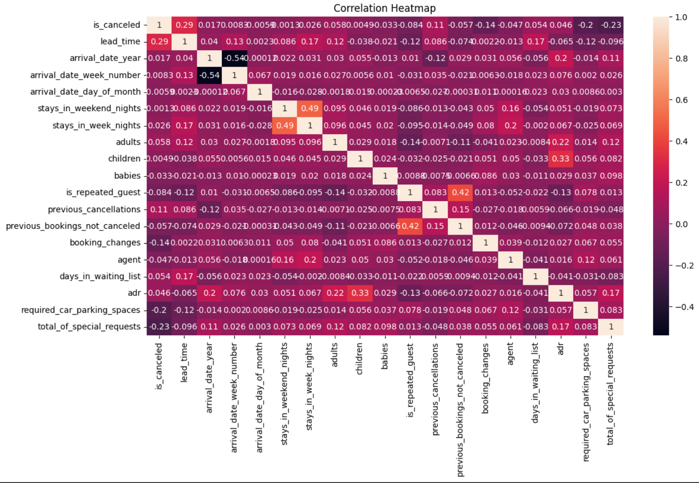

# Hotel Booking Analysis (EDA) 🏨🕵️‍♀️

## Introduction
The hospitality industry faces dynamic challenges, including fluctuating booking trends, high cancellation rates, and evolving customer preferences. This project explores the **Hotel Booking dataset** to uncover booking trends, identify factors influencing cancellations, and provide actionable insights for hotels to optimize operations and enhance customer satisfaction.

---

## Objectives
- ✔️ Perform data cleaning and preprocessing to handle missing and inconsistent data.
- ✔️ Analyze booking trends across time, geography, and customer types.
- ✔️ Investigate key factors contributing to cancellations and identify high-risk groups.
- ✔️ Visualize the findings to make insights more interpretable.

---

## Tools Used🔧
- **Programming Language**: Python
- **Python Libraries**: `pandas`, `numpy`, `seaborn`, `matplotlib`, `plotly`
- **Environment**: Google Colab for interactive analysis and visualizations.

---

## Dataset
- **Source**: [Hotel Booking Data](https://www.kaggle.com/jessemostipak/hotel-booking-demand)
- **Key Features Explored**:
-  - Hotel Type: City Hotel vs. Resort Hotel
-  - Booking Lead Time: Time between booking and actual stay
-  - Customer Type: Transient, group, or contract customers
-  - Cancellation Status: Whether a booking was cancelled

---

## Key Insights 📊
✅ **Booking Patterns**:
   - **Portugal** is the top country for bookings, highlighting its significance for targeted marketing strategies.
   - **City Hotels** are preferred over Resort Hotels, especially during non-holiday seasons.
   - Peak booking season is **July**, likely driven by summer vacations.

❌ **Cancellation Dynamics**:
   - **City Hotels** have a significantly higher cancellation rate, suggesting the need for retention strategies like flexible cancellation policies or targeted offers.
   - **Transient customers** exhibit higher cancellation rates, emphasizing the importance of understanding their booking behavior.

🛏️ **Customer Behavior**:
   - **Families with children** tend to book Resort Hotels more often, showcasing a preference for family-friendly amenities.
   - Cancellation rates are higher for transient customers, indicating last-minute plan changes.

---

## Visualizations
📌 **Monthly Booking Trends**: Highlights seasonality and high-demand periods.  

   

📌 **Cancellation by Hotel Type**: Compares cancellation rates for City and Resort Hotels.  

   

📌 **Cancellation by Customer Type**: Explores cancellation trends for different customer categories.  

   

📌 **Correlation Heatmap**: Shows relationships between numerical variables.  

   

## Next Steps 🚀
- **Predictive Modeling**: Build machine learning models to forecast cancellations and booking trends.
- **Hypothesis Testing**: Validate insights, such as the impact of deposit types on cancellations.
- **Customer Segmentation**: Use clustering techniques to identify distinct customer groups and their preferences.

---

## Acknowledgments
- Dataset provided by [Kaggle](https://www.kaggle.com).
- Inspired by the data science and hospitality community for actionable analytics.
