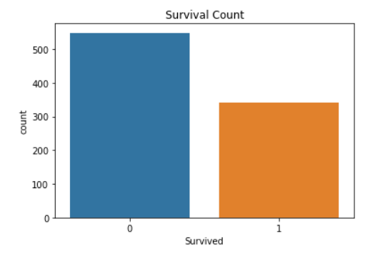
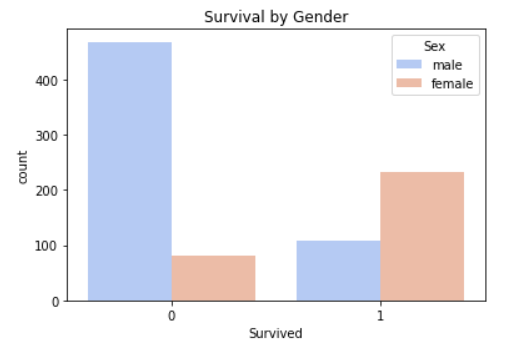
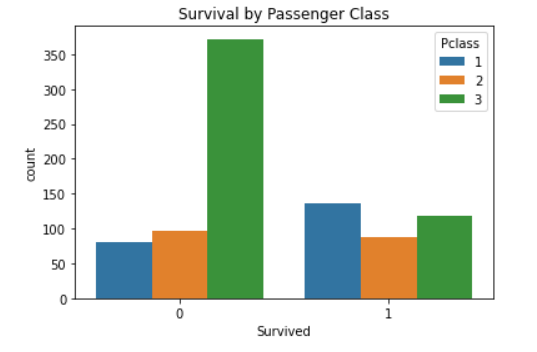
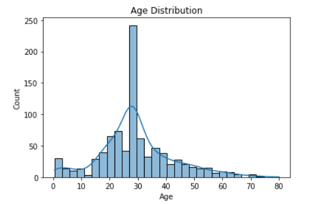

# Titanic Survival Analysis (EDA) 🚢⚓  

## Introduction  
The **Titanic disaster** is one of the most well-known shipwrecks in history. This project explores the **Titanic dataset** to analyze survival patterns, identify key factors influencing survival, and uncover insights using **Exploratory Data Analysis (EDA)**. Understanding these trends can provide a data-driven perspective on survival determinants like **gender, class, age, fare, and embarkation point**.  

## Objectives  
- ✅ Perform **data cleaning** and handle missing values effectively.  
- ✅ Explore **survival distribution** across different demographics.  
- ✅ Analyze how factors like **passenger class, gender, age, and fare** affected survival rates.  
- ✅ Use **visualizations** to communicate insights effectively.  

## Tools Used 🔧  
- **Python Libraries**: `pandas`, `numpy`, `seaborn`, `matplotlib`  
- **Statistical Tests**: Chi-square test to determine categorical feature significance.  
- **Environment**: Kaggle Notebook for interactive analysis.  

## Data Overview  
- **Dataset**: [Titanic - Machine Learning from Disaster](https://www.kaggle.com/c/titanic/data)  

## Insights  
✅ **Survival Overview**:  
   - **38% of passengers survived**, while **62% did not**, showing the tragic scale of the disaster.  

✅ **Impact of Gender**:  
   - **Women had a significantly higher survival rate** (~74%) compared to men (~19%), supporting the "women and children first" evacuation rule.  

✅ **Passenger Class Influence**:  
   - **First-class passengers** had the highest survival rate (~63%), whereas **third-class passengers** had the lowest (~24%).  

✅ **Age Distribution & Survival**:  
   - **Children (0-12 years old) had better survival rates**, while survival rates declined for older passengers.  
   - **Seniors (50+) had lower survival chances**, highlighting the advantage of youth.  

✅ **Embarkation & Fare Impact**:  
   - **Passengers who embarked from Cherbourg ('C') had a higher survival rate** (~55%).  
   - **Higher ticket prices were correlated with increased survival chances**, emphasizing the role of wealth.  

✅ **Family Size Influence**:  
   - **Large families (5+ members) had a lower survival rate**, suggesting overcrowding or difficulties escaping.  

## Visualizations  
1. **Survival Distribution**: A count plot showcasing overall survival rates.  
     

2. **Survival by Gender**: Highlights the strong impact of gender on survival.  
     

3. **Survival by Passenger Class**: Demonstrates how class influenced survival chances.  
     

4. **Age Distribution**: Shows the age spread among passengers.  
     

## Statistical Analysis 📊  
- **Chi-Square Tests** were conducted for categorical features:  
  - **Sex** (p-value = 0.00000) → **Highly significant**  
  - **Pclass** (p-value = 0.00000) → **Highly significant**  
  - **Embarked** (p-value = 0.00000) → **Significant**  

## Next Steps 🚀  
- **Feature Engineering**: Create new features based on relationships found in EDA.  
- **Model Selection & Prediction**: Move to a separate repository for predictive modeling.  
- **Survival Probability Modeling**: Train machine learning models to predict survival likelihood.  

## Acknowledgments  
- Dataset provided by [Kaggle](https://www.kaggle.com/c/titanic).  
- Inspired by data science competitions and survival analysis research.  
