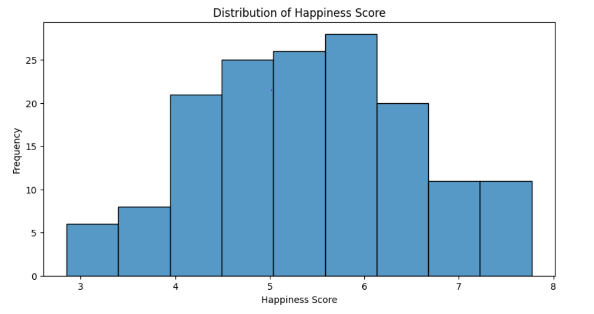
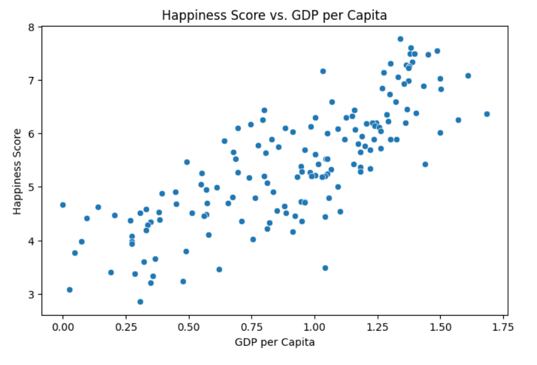
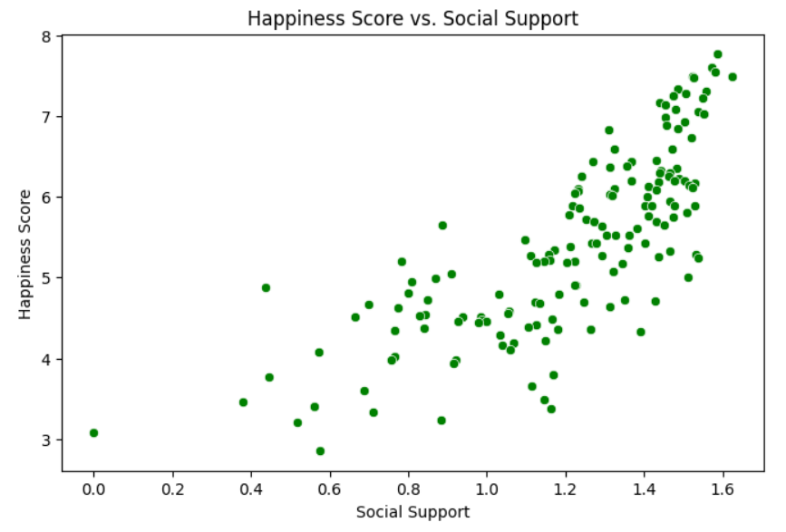
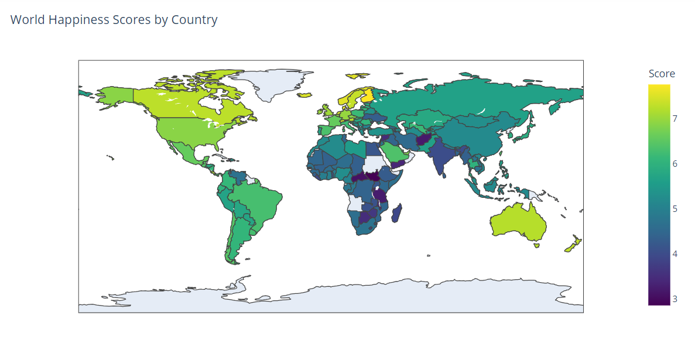
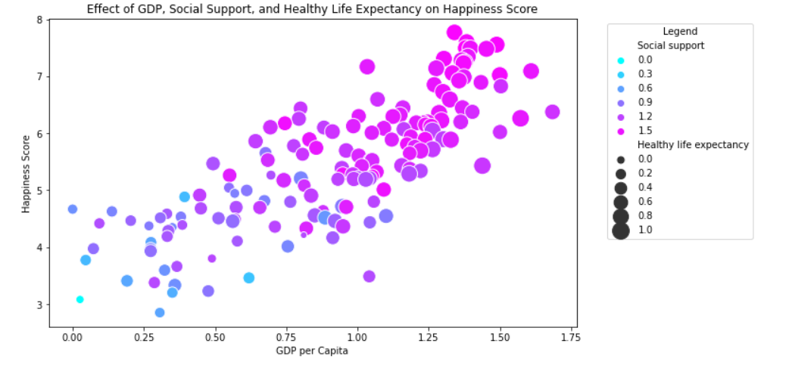

# World Happiness Analysis (EDA) 🌍😊

## Introduction  
Happiness is a key indicator of a nation's well-being and quality of life. This project explores the **2019 World Happiness dataset** to uncover patterns in global happiness, identify factors contributing to happiness, and analyze how economic, social, and health indicators impact happiness levels. The insights can assist policymakers in prioritizing efforts to enhance citizens' well-being.

## Objectives  
- ✅ Perform data cleaning and preprocessing to handle missing or inconsistent data.  
- ✅ Analyze the distribution and trends in happiness scores globally.  
- ✅ Examine the relationships between **GDP per capita**, **social support**, and **healthy life expectancy** with happiness.  
- ✅ Visualize findings to communicate key insights effectively.  

## Tools Used 🔧  
- **Python Libraries**: `pandas`, `numpy`, `seaborn`, `matplotlib`, `plotly`  
- **Environment**: Kaggle Notebook for streamlined analysis and interactive visualizations.  

## Data Overview  
- **Dataset**: [World Happiness Report 2019](https://www.kaggle.com/unsdsn/world-happiness)  
  

## Insights  
✅ **Happiness Distribution**:  
   - The most common happiness score across countries is approximately **6**, as seen in the histogram.  

✅ **Economic Prosperity and Happiness**:  
   - Higher **GDP per capita** is strongly correlated with higher happiness scores.  

✅ **Social Support and Happiness**:  
   - Countries with greater **social support** tend to have higher happiness scores, highlighting the role of community and relationships.  

✅ **Health and Longevity**:  
   - Improved **healthy life expectancy** significantly contributes to higher happiness scores.  

✅ **Regional Trends**:  
   - Countries in **Australia, North America, and South America** show higher happiness scores compared to **Asia and Africa**, where scores are generally lower.  

✅ **Multifactor Impact**:  
   - Nations with high **GDP per capita**, **social support**, and **healthy life expectancy** score the highest on the happiness index, emphasizing a balanced approach to economic, social, and health development.  

## Visualizations  
1. **Distribution of Happiness Scores**: Highlights the most frequent scores globally.  
     

2. **Happiness vs. GDP per Capita**: Visualizes the positive correlation with a regression line.  
     

3. **Happiness vs. Social Support**: Examines the impact of strong social networks.  
     

4. **Global Happiness Map**: Displays happiness scores geographically.  
     

5. **Combined Impact of Factors**: Shows how GDP, social support, and life expectancy influence happiness.  
     

## Next Steps 🚀  
- **Trend Analysis**: Analyze happiness data across multiple years to identify trends over time.  
- **Causal Modeling**: Explore causal relationships to understand the relative importance of each factor.  
- **Predictive Modeling**: Build models to forecast happiness scores based on economic, social, and health indicators.  
- **Regional Policies**: Investigate policies from high-scoring countries and suggest actionable strategies for low-scoring regions.  

## Acknowledgments  
- Dataset provided by [Kaggle](https://www.kaggle.com/unsdsn/world-happiness).  
- Inspired by the data science and public policy communities for actionable insights.  

---

Would you like me to assist with creating or refining visuals or adding any other sections? 😊